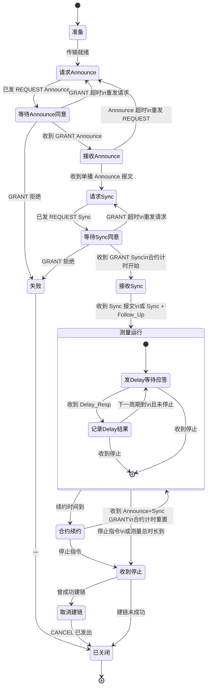
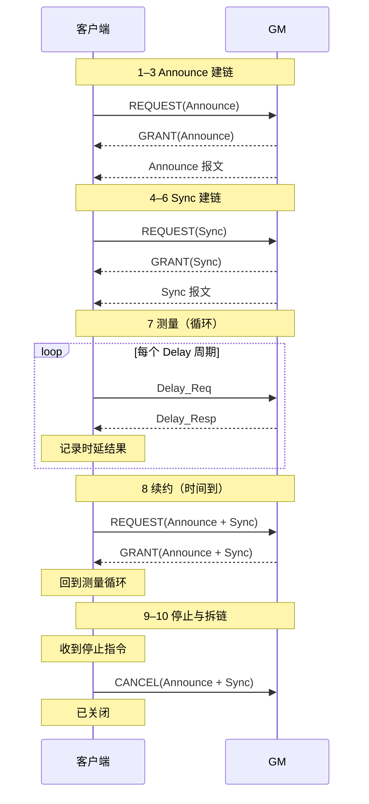
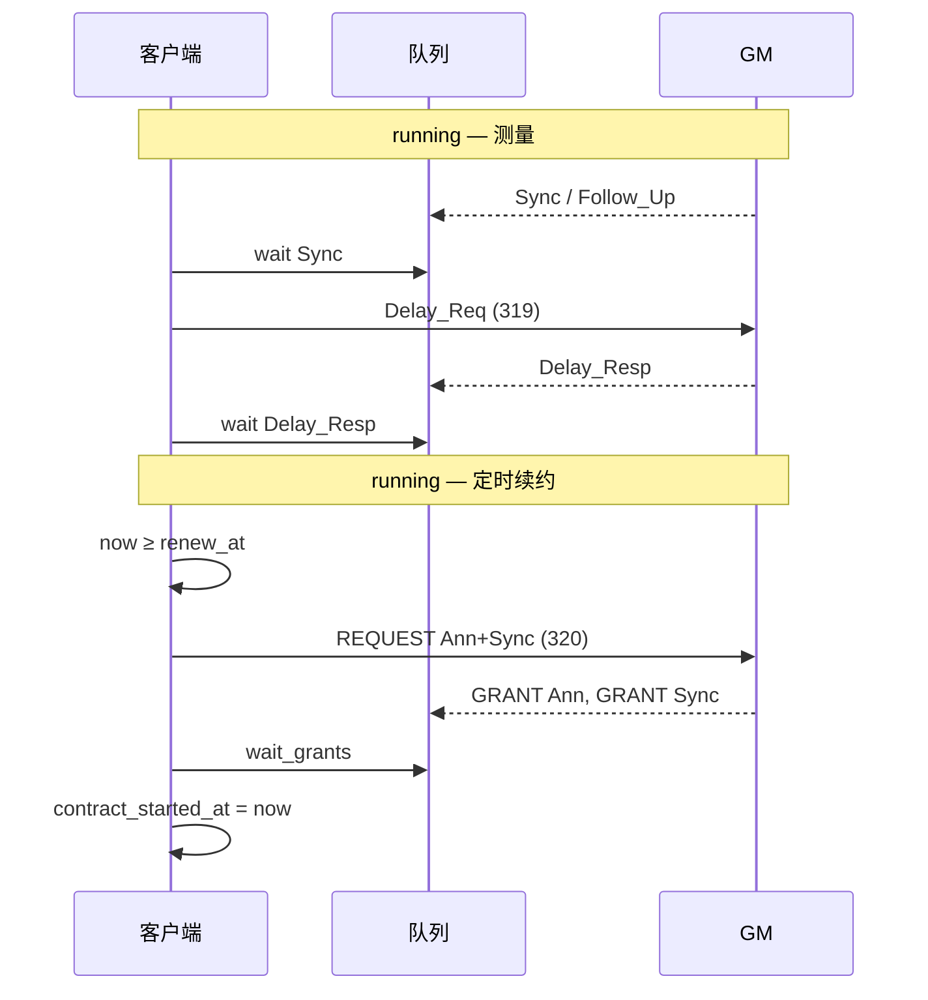
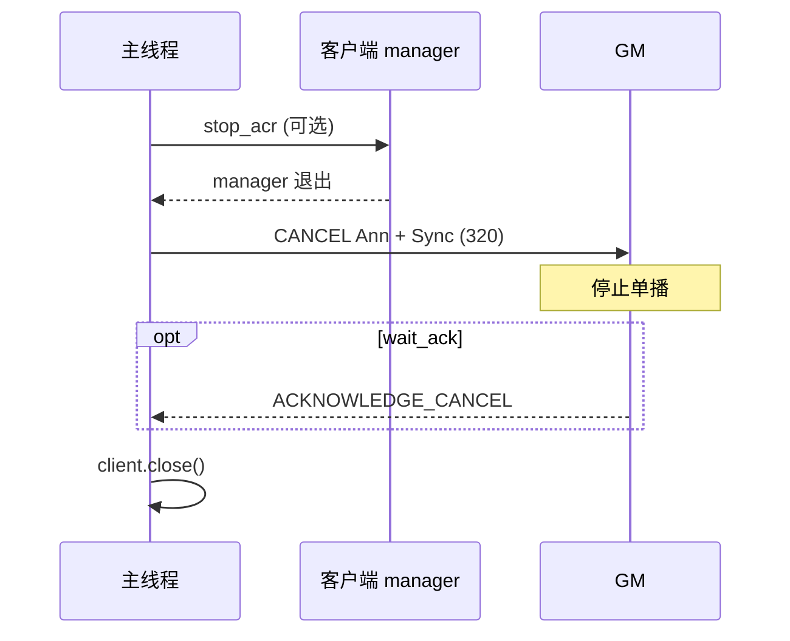

# G.8275.2 单播 ACR 客户端 — 设计说明

> **目的**：以 **客户端逻辑** 为主线，描述从创建到退出的完整生命周期，包括 Signalling 协商、运行期测量、**合约到期续约** 与 **CANCEL 拆除**。  
> **范围**：`PTPAcrUnicastClient`（传输 + 收包）+ `G82752UnicastSession`（G.8275.2 客户端逻辑）。  
> **原则**：每个客户端实例只维护一份状态；收包线程只投递报文；客户端按阶段「发 → 等 → 改状态」。

---

## 1. 分工概览

| 组件 | 职责 | 不负责 |
|------|------|--------|
| **收包线程** `ptp-recv` | `select` 319/320 → 解析 PTP 头 → 入队 → `notify` | 协商、续约、测量、Cancel |
| **客户端逻辑** `g82752-manager` | 维护状态与阶段；发 Signalling / Delay_Req；从队列等包 | `recvfrom` |
| **主线程** | `start` / `wait_acr` / `stop_acr` / `cancel_unicast` / `close` | 业务循环 |

收包与客户端之间仅通过 **线程安全报文队列** 交互（当前实现名 `_general_buf`，319/320 共用）。

---

## 2. 客户端状态

每个 `G82752UnicastSession` 实例持有一份状态，生命周期内不与其他实例共享可变字段。

```text
ClientState
├── phase                 # 当前阶段（见 §3，如：等待Announce同意、测量运行、合约续约）
├── gm                    # GM 的 sourcePortIdentity（首条 Announce 得到）
├── grants                # 各 messageType → GRANT 的 durationField（秒）
├── contract_started_at   # 最近一次成功 GRANT 的单调时钟起点（续约计时用）
├── negotiate_delay_resp  # 是否在 Signalling 里协商 Delay_Resp（ACR 默认 false）
├── seq / 测量缓存        # Delay_Req 序号、最近 offset 估计等
└── stop_requested        # 外部 stop 标志
```

`G82752NegotiationState` 是协商成功后的快照（`gm` + `grants` + log period），写入 `session.state`。

---

## 3. 客户端生命周期（状态机）

客户端从建链到拆链的完整过程如下，**严格按顺序**推进；收包线程只负责把报文投递到队列，**何时发请求、等到什么再往下走** 全部由客户端逻辑根据当前状态决定。

### 3.1 生命周期步骤（总览）

| 序号 | 阶段 | 客户端发送 | 客户端等待 / 接收 | 进入下一阶段条件 |
|------|------|------------|-------------------|------------------|
| 0 | 准备 | — | 传输就绪（端口绑定、收包启动） | 可以发 Signalling |
| **1** | **请求 Announce** | Signalling：`REQUEST(Announce)` | — | 请求已发出 |
| **2** | **等待 Announce 同意** | — | Signalling：`GRANT(Announce)` | GM 同意（duration > 0） |
| **3** | **接收 Announce** | — | 单播 **Announce** 报文 | 收到首条 Announce，记录 GM |
| **4** | **请求 Sync** | Signalling：`REQUEST(Sync)` | — | 请求已发出 |
| **5** | **等待 Sync 同意** | — | Signalling：`GRANT(Sync)` | GM 同意 |
| **6** | **接收 Sync** | — | **Sync**（两步法时还有 **Follow_Up**） | 收到 Sync 样本，建链完成 |
| **7** | **测量运行** | 按配置频率发 **Delay_Req**（319） | **Delay_Resp**（320），并记录每次时延结果 | 见 §3.3；期间可转入序号 8 |
| **8** | **合约续约** | Signalling：`REQUEST(Announce + Sync)` | `GRANT(Announce)` 且 `GRANT(Sync)` | 续约成功，重置合约计时，回到序号 7 |
| **9** | **收到停止** | — | 外部停止指令或测量总时长到 | 业务循环结束 |
| **10** | **取消建链** | Signalling：`CANCEL(Announce + Sync)` | 可选：`ACKNOWLEDGE_CANCEL` | CANCEL 已发出 |
| **11** | **已关闭** | — | 收包与 socket 关闭 | 终态 |

**要点**：

- 序号 1→3 与 4→6 各是一轮「**发请求 → 等 GRANT 同意 → 等实际业务报文**」，Announce 必须先于 Sync 完成。
- 序号 7 在收到 **Sync 报文之后** 才开始；Delay_Req **不走 Signalling**，按本地配置的 `requestIntervalSec` 周期发送。
- 序号 8 仅在 **续约时间到**（合约 duration 临近到期）时插入，完成后回到序号 7，**不重复**序号 1→6 的全套建链。
- 序号 10 仅在 **收到停止（序号 9）之后** 执行，用于通知 GM 停止单播并拆除 Signalling 合约。

### 3.2 完整状态机

下图与 §3.1 序号一一对应；边上为 **触发条件**，不含代码接口名。



### 3.3 各状态说明

#### 建链阶段（序号 1–6）

```text
  请求Announce ──► 等待Announce同意 ──► 接收Announce
        ▲                  │                    │
        └──── GRANT/Announce 超时重发 ────────────┘

  请求Sync ──► 等待Sync同意 ──► 接收Sync ──► 测量运行
       ▲              │
       └── GRANT 超时重发
```

| 状态 | 含义 | 超时处理 |
|------|------|----------|
| 请求 Announce | 向 GM 发 Signalling，请求单播 Announce | — |
| 等待 Announce 同意 | 等 `GRANT(Announce)` | 重发 REQUEST |
| 接收 Announce | GRANT 已收，等 **Announce 报文本身** | 重发 REQUEST(Announce) |
| 请求 Sync | 向 GM（目标为已识别的 GM）发 `REQUEST(Sync)` | — |
| 等待 Sync 同意 | 等 `GRANT(Sync)` | 重发 REQUEST |
| 接收 Sync | GRANT 已收，等 **Sync 报文**（及 Follow_Up） | 可触发强制续约后重试 |

#### 测量阶段（序号 7）

进入 **测量运行** 的前提：已收到至少一个 **Sync 样本**（含 Follow_Up 若两步）。

```text
        ┌──────────────────────────────────────┐
        │           测量运行（循环）              │
        │                                      │
        │   按 requestIntervalSec 发 Delay_Req │
        │              ↓                       │
        │        等待 Delay_Resp               │
        │              ↓                       │
        │   记录：seq、t3/t4、offset、delay     │
        │              ↓                       │
        │   未到停止 → 下一周期 ───────────────┘
        │
        │   并行检查：续约时间是否到 → 序号 8
        └──────────────────────────────────────┘
```

| 动作 | 说明 |
|------|------|
| 发 Delay_Req | 319 口，频率由 `requestIntervalSec` 决定，**不写进 PTP 头** |
| 收 Delay_Resp | 320 口，按 sequenceId、requestingPortIdentity 匹配 |
| 记录 | 每次成功交换保存时戳与 offset / 路径时延估计 |
| 与 Sync 的关系 | 周期测量可复用首次 Sync 样本算 offset；GM 仍按 GRANT 速率发 Sync |

#### 续约阶段（序号 8）

| 项目 | 说明 |
|------|------|
| **何时进入** | `合约开始时间 + durationSec - 余量` 到达（余量 = max(10s, 25%·duration)） |
| **发送** | 一帧 Signalling 含 `REQUEST(Announce)` + `REQUEST(Sync)` |
| **等待** | `GRANT(Announce)` 与 `GRANT(Sync)` |
| **成功后** | 更新合约记录、重置合约计时，**回到测量运行** |
| **与建链区别** | 不再走「接收 Announce / 接收 Sync」；GM 应持续单播 |

#### 停止与拆链（序号 9–11）

```text
  测量运行 ──► 收到停止 ──► 取消建链 ──► 已关闭
                              │
                              └─ Signalling CANCEL(Announce, Sync)
```

| 状态 | 含义 |
|------|------|
| 收到停止 | 外部停止指令，或配置的总测量时长耗尽 |
| 取消建链 | 向 GM 发 CANCEL，告知停止单播；可选等 ACK |
| 已关闭 | 收包线程结束、socket 关闭 |

**顺序约束**：必须先 **收到停止**，再 **发 CANCEL**；运行中不主动 CANCEL。

### 3.4 端到端时序



下文 §4–§6 展开各阶段的报文字段、超时与配置；实现行为应与 §3.1 步骤顺序一致。

---

## 4. 初始协商（negotiating）

G.8275.2 clause 6.6：先 Announce，再 Sync；Delay 在 ACR 默认路径下 **不走 Signalling**。

### 4.1 Phase 1 — Announce

| 步 | 发送（320 Signalling） | 等待（队列） | 状态变更 |
|----|------------------------|--------------|----------|
| 1 | `REQUEST_UNICAST`（Announce，`durationSec`，`announceLogPeriod`） | `GRANT` Announce | `grants[Announce]`；拒绝（duration=0）→ 失败 |
| 2 | — | 第一条单播 **Announce** | `gm = sourcePortIdentity` |
| 2' 超时 | 重发步 1 | — | 最多 3 次 |

targetPortIdentity：Phase 1 用 **wildcard**（`0xFF…`）。

### 4.2 Phase 2 — Sync

| 步 | 发送 | 等待 | 状态变更 |
|----|------|------|----------|
| 1 | `REQUEST_UNICAST`（Sync [+ Delay_Resp 若开启]） | 对应 GRANT | 写入 `grants` |
| 1' 超时 | 同一 REQUEST，target 改 **wildcard** 重试 | — | — |
| 2 | — | — | `phase=running`，`contract_started_at=now`，`session.state` 落盘 |

targetPortIdentity：优先 **gm**；失败再 wildcard。

### 4.3 协商失败

- `UnicastDeniedError`：GRANT durationField=0 或多次拒绝。  
- `UnicastNegotiationTimeout`：REQUEST 后 GRANT 超时，或首条 Announce 超时。  
- manager 捕获异常 → `_manager_error` → `wait_acr()` 向上抛出；**不自动 Cancel**（由主线程决定是否拆除）。

---

## 5. 运行期（running）— 测量与续约

`running` 阶段做两件事，在同一线程、同一循环里交错进行：

1. **ACR 测量**：等 Sync/Follow_Up → 发 Delay_Req（319）→ 等 Delay_Resp（320）→ 算 offset/delay。  
2. **合约续约**：在 `durationField` 到期前主动重签 Announce+Sync 合约。

### 5.1 ACR 测量循环

```
进入 running：
  等 Sync（+ Follow_Up 若两步）；Sync 超时 → 强制续约 → 再等 Sync

loop 直到 measure_duration_sec 或 stop：
  检查续约（见 §5.2）
  发 Delay_Req → 等 Delay_Resp
  成功 → 回调 on_estimate / 打印统计
  Delay_Resp 超时 → 强制续约；周期模式下 continue，否则结束
  若 requestIntervalSec > 0 → sleep 间隔（sleep 期间也检查续约）
```

| 配置 | 含义 |
|------|------|
| `requestIntervalSec` | 客户端本地 Delay_Req 间隔，**不写** PTP 头 |
| `syncTimeout` / `delayTimeout` | 等 Sync / Delay_Resp 上限 |
| `measure_duration_sec` | 测量总时长（CLI 默认 = `durationSec`） |

Delay_Req/Delay_Resp 为 IEEE 1588 E2E，**不**依赖 Signalling GRANT（ACR 默认）。

### 5.2 合约与续约（Announce / Sync 到期）

Signalling 里 REQUEST/GRANT 的 **durationField**（秒）定义 GM 向本客户端单播 Announce/Sync 的承诺时长。到期前客户端必须 **续约**（re-REQUEST），否则 GM 停止单播，Sync 超时、测量中断。

#### 5.2.1 计时模型

```text
margin = max(10s, 25% × durationSec)     # G.8275.2：留足重试余量
renew_at = contract_started_at + durationSec - margin
```

- `contract_started_at`：每次 **初始协商成功** 或 **续约 GRANT 成功** 后重置。  
- `_seconds_until_renewal() = renew_at - now`；≤ 0 表示应续约。

#### 5.2.2 触发条件

| 类型 | 条件 | force |
|------|------|-------|
| **定时** | `now ≥ renew_at` | false |
| **强制** | Sync 超时、Delay_Resp 超时 | true |
| **手动** | 调用 `renew_now()` | — |

定时检查嵌入在：每轮 Delay 前、sleep 间隔内（`_sleep_until_next_or_deadline`）。

#### 5.2.3 续约动作（phase → renewing → running）

续约 **不是** 重新走「等首条 Announce」；GM  identity 已知，单播流应持续。

| 步 | 发送（320） | 等待 | 状态变更 |
|----|-------------|------|----------|
| R1 | 单帧 Signalling，含 **两个** REQUEST TLV：Announce + Sync（参数与初协商相同：`durationSec`、log period） | GRANT Announce **且** GRANT Sync | 失败 → wildcard target 重试 |
| R2 | — | — | 更新 `grants`；`contract_started_at = now`；回到 `running` |

若 `negotiate_delay_resp=true`，续约 REQUEST 一并带上 Delay_Resp。

#### 5.2.4 续约失败策略

- GRANT 超时 / denied：打日志，**不抛致命异常**（当前实现 `_renew_if_due` 吞掉错误返回 false）。  
- 测量循环继续；后续 Sync/Delay 超时可能再次 **force** 续约。  
- 设计意图：避免因单次续约失败立刻终止长跑任务；连续失败应靠日志与 metrics 告警（待实现）。

#### 5.2.5 续约与首协商的差异

| 项目 | 初协商 | 续约 |
|------|--------|------|
| Announce REQUEST | 单独一帧 | 与 Sync 同帧 |
| 等首条 Announce | 是 | **否** |
| target | Phase1 wildcard；Phase2 gm | gm，失败 wildcard |
| 重置 `contract_started_at` | 协商完成时 | 每次 GRANT 成功 |

### 5.3 运行期时序



---

## 6. 停止与拆除（stopping → cancelling）

### 6.1 正常结束路径

```text
主线程                          客户端 manager
   |                                 |
   | start_acr()                     | negotiate → measure_acr loop
   | wait_acr() 阻塞                 | ...
   |                                 | measure 结束 → manager 退出
   | wait_acr 返回                   |
   | [可选] cancel_unicast()         |
   | client.close()                  | 收包线程 stop
```

1. **`stop_acr()`**：置 `_stop_manager`；manager 在测量循环内检测到后退出（不保证立刻停）。  
2. **`wait_acr()`**：等 manager 结束；若有异常则 re-raise。  
3. **`cancel_unicast()`**（可选）：向 GM 声明不再接收单播流。  
4. **`client.close()`**：停收包、关 socket。

CLI `--cancel-after`：在 `wait_acr` 成功后自动调用 `cancel_unicast(wait_ack=False)`。

### 6.2 CANCEL 语义

客户端主动结束 Signalling 合约，告知 GM 停止向本端口单播 Announce/Sync（及已协商的 Delay_Resp）。

| 步 | 发送（320 Signalling） | 等待 | 说明 |
|----|------------------------|------|------|
| C1 | 一帧内多个 `CANCEL_UNICAST_TRANSMISSION` TLV：Announce、Sync（+ Delay_Resp 若曾协商） | — | target = `gm`；未协商时 wildcard |
| C2 | — | 可选：`ACKNOWLEDGE_CANCEL` TLV | `wait_ack=True` 且 `cancel_ack_timeout` 内 |

- **不 Cancel 的后果**：GM 可能继续单播直到原 durationField 自然过期，浪费 GM 资源。  
- **Cancel 与 stop 顺序**：应先 `stop_acr`（或等 manager 自然结束），再 `cancel_unicast`；Cancel 可在主线程调用，与 manager 并发时需 `_renewal_lock` 意识（当前 Cancel 未持锁，设计上 Cancel 应在 manager 停止后调用）。  
- **收到 GM 侧 Cancel**：本客户端为 request-port，通常 **发送** Cancel；若收到对端 Cancel/ACK，收包线程照常入队，当前 **不处理** 入站 Cancel（可扩展为日志或 phase 变更）。

### 6.3 异常结束

| 场景 | manager | 建议主线程动作 |
|------|---------|----------------|
| 协商超时/拒绝 | 退出并设置 `_manager_error` | 一般无需 Cancel（尚无有效合约） |
| 测量中异常 | 同上 | 若已 `negotiate` 成功，宜 `cancel_unicast` |
| `wait_acr` 超时 | manager 可能仍在跑 | `stop_acr` → 可选 Cancel → `close` |

### 6.4 拆除时序



---

## 7. 客户端主循环（逻辑伪代码）

以下为 **单一 manager 线程** 内的目标结构，体现生命周期与续约/Cancel 边界：

```python
def client_main():
    phase = "negotiating"
    try:
        state = negotiate_announce_then_sync()   # §4
        phase = "running"
        contract_started_at = now()

        sync_sample = wait_sync_with_renew_on_timeout()

        deadline = now() + measure_duration_sec
        while not stop_requested and now() < deadline:
            renew_if_due()                       # §5.2

            delay = exchange_delay_or_renew_on_timeout()
            report_estimate(delay, sync_sample)

            sleep_until_next(delay_interval, deadline, renew_check=True)

        phase = "stopping"
    except NegotiationError:
        phase = "stopping"
        raise
    finally:
        manager_finished.set()


# 主线程在 wait_acr 返回后：
def shutdown(session, cancel: bool):
    session.stop_acr()          # 若 manager 仍在跑
    if cancel and session.state:
        session.cancel_unicast(wait_ack=False)   # §6.2
    session.client.close()
```

**`renew_if_due()`** 内部：

```python
def renew_if_due(force=False):
    if state is None: return
    if not force and seconds_until_renewal() > 0: return
    phase = "renewing"
  send REQUEST(Announce + Sync, target=gm)
  grants = wait_grants([Announce, Sync])
  update grants; contract_started_at = now()
    phase = "running"
```

---

## 8. 等包 API（客户端消费队列）

客户端 **从不** `recv`，仅：

| API | 用途 |
|-----|------|
| `wait_one(accept, deadline)` | 单条：Announce、Sync、Delay_Resp、CANCEL ACK |
| `wait_grants(types, deadline)` | 多帧 Signalling GRANT 聚合 |

深度解析（TLV、Follow_Up body、Delay_Resp body）在 **取出之后** 由客户端完成；收包线程只做 `PTPHeader.unpack`。

---

## 9. Signalling TLV 与端口

| TLV | 方向 | 作用 |
|-----|------|------|
| REQUEST_UNICAST (0x0004) | 客户端 → GM | 请求单播某 messageType + duration |
| GRANT_UNICAST (0x0005) | GM → 客户端 | 批准；duration=0 表示拒绝 |
| CANCEL_UNICAST (0x0006) | 客户端 → GM | 取消单播合约 |
| ACKNOWLEDGE_CANCEL (0x0007) | GM → 客户端 | 确认 Cancel |

| 端口 | 客户端发 | 客户端收（经收包线程） |
|------|----------|------------------------|
| 319 event | Delay_Req | Sync（部分 GM） |
| 320 general | Signalling 全部 | GRANT、Announce、Sync、Follow_Up、Delay_Resp |

---

## 10. 配置映射

| 配置项 | 生命周期阶段 | 作用 |
|--------|--------------|------|
| `durationSec` | 协商、续约 | REQUEST/GRANT durationField；续约周期基准 |
| `announceLogPeriod` / `syncLogPeriod` | 协商、续约 | REQUEST TLV 内 GM 单播速率 2^n 秒 |
| `requestIntervalSec` | running | Delay_Req 本地间隔 |
| `syncTimeout` / `delayTimeout` | running | 等包超时；可触发强制续约 |
| `measure_duration_sec` | running | 测量循环总时长 |
| `request_timeout` / `first_announce_timeout` | negotiating | Signalling / 首 Announce 等待 |
| `cancel_ack_timeout` | cancelling | 等 ACK 上限 |

---

## 11. 实现约定

1. 只有收包线程 `recvfrom`；只有客户端逻辑发 Signalling / Delay_Req。  
2. 一份 session 一份状态；续约只更新 Signalling 合约，不重新发现 GM。  
3. 续约检查与测量 **同线程**，不另开 renewal 线程。  
4. Cancel 在合约有效时 **应尽量发送**，避免 GM 侧资源泄漏。  
5. 超时与失败走 **明确分支**（重发 REQUEST / force 续约 / 退出 / Cancel），避免隐式依赖。  
6. ACR 默认：Signalling 仅 Announce+Sync；Delay 走 E2E。

---

## 12. 与当前代码的对照

| 设计项 | 当前实现 | 备注 |
|--------|----------|------|
| 显式 `phase` | 无，顺序调用 | 可对齐 §3 枚举 |
| 生命周期 Cancel | `cancel_unicast()` 已有 | CLI `--cancel-after` |
| 定时续约 | `_renew_if_due` + `_margin_seconds` | 嵌入 `measure_acr` |
| 强制续约 | Sync/Delay 超时 `force=True` | 已实现 |
| manager 停止 | `_stop_manager` | 测量循环内检查 |
| 队列名 | `_general_buf` | 建议改为 `_rx_queue` |

功能上已覆盖 §4–§6 主路径；后续改代码优先 **显式 phase** 与 **shutdown 顺序文档化到代码注释**，不必引入事件总线。

---

## 13. 源文件

| 文件 | 职责 |
|------|------|
| `src/ptp_client/ptp/g82752_unicast.py` | 客户端逻辑：协商、测量、续约、Cancel、manager 线程 |
| `src/ptp_client/ptp/client.py` | Socket、收包线程、队列、Sync/Delay 交换 |
| `src/ptp_client/ptp/signaling.py` | REQUEST / GRANT / CANCEL TLV |
| `src/ptp_client/ptp/cli.py` | 启停、`--cancel-after` |
| `config/ptp-acr-client.json` | 运行参数 |

---

## 14. 待确认（可选）

1. Cancel 是否默认 `wait_ack=True`（当前 CLI 为 false，偏快速退出）。  
2. 续约连续失败 N 次后是否应置 `phase=stopping` 并告警。  
3. 是否处理 GM 主动发来的 CANCEL（电信网部分场景）。

---

## 15. 多客户端扩展

同一 GM（`server_ip`）上管理大量客户端（如 2048）：**共享网卡 319/320 收包、按目的 IP 分流、每 Client 自治 §3 状态机、统一 TxQueue 发包**，见 [g82752-multi-client-fleet.md](./g82752-multi-client-fleet.md)。
