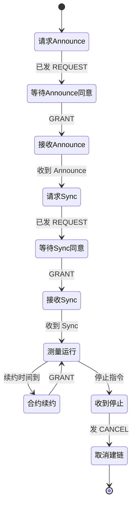
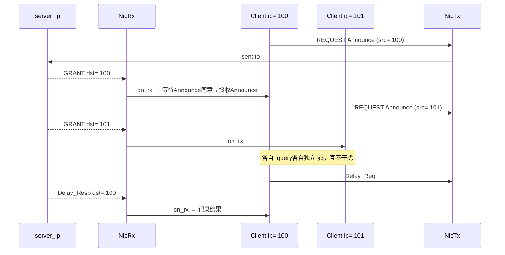

# G.8275.2 多客户端 — 共享网卡收发包模型

> **目的**：在 [单客户端 §3 生命周期](./g82752-acr-thread-architecture.md) 之上，支持 **N 个（约 2048）** 逻辑客户端共用 **同一 GM（server_ip）**。  
> **原则**：  
> - **每个客户端自己管自己的状态** — 收到属于它的报文就尝试进入下一状态；  
> - **不搞** FleetManager / Scheduler / Worker 池；  
> - **网卡侧只保留两个面**：统一收包、统一发包队列；**不为每个客户端各开一对 socket**。

---

## 1. 思路对比

| 上一版（已废弃） | 本版 |
|------------------|------|
| FleetManager + Scheduler + Worker 池 | 无中心调度器；客户端自治状态机 |
| 每客户端 2 个 socket（2N fd） | **全进程仅 2 个收包 socket**（319 + 320，绑 `0.0.0.0`） |
| fd → client_id 分流 | **目的 IP → client** 分流（见 §4） |
| Worker 调 `tick()` | 收包线程 **直接** `client.on_rx()` |

---

## 2. 总体结构（三个部分）

```text
                    server_ip (GM)
                          │
           ┌──────────────┴──────────────┐
           │                             │
           ▼                             ▼
    UDP 319 (event)              UDP 320 (general)
           │                             │
           └──────────────┬──────────────┘
                          │
                          ▼
                 ┌─────────────────┐
                 │    NicRx        │  1 条线程：监控网卡上的 319/320
                 │  src == server_ip│  解析目的 IP → 找到 Client
                 │  → client.on_rx()│  **同步** 驱动状态前进
                 └────────┬────────┘
                          │
        ┌─────────────────┼─────────────────┐
        ▼                 ▼                 ▼
   ┌─────────┐       ┌─────────┐       ┌─────────┐
   │ Client 0│       │ Client 1│  ...  │Client N-1│
   │ phase   │       │ phase   │       │ phase    │
   │ §3 FSM  │       │ §3 FSM  │       │ §3 FSM   │
   └────┬────┘       └────┬────┘       └────┬─────┘
        │ 要发包           │                 │
        └─────────────────┼─────────────────┘
                          ▼
                 ┌─────────────────┐
                 │    TxQueue      │  全局 FIFO（线程安全）
                 │ (client, ch, buf)│
                 └────────┬────────┘
                          ▼
                 ┌─────────────────┐
                 │    NicTx          │  1 条线程：出队 → sendto
                 │  → server_ip      │  源地址 = 该 client 的本机 IP
                 └─────────────────┘
```

**只有 2 个收包 socket + 1 个发包队列 + 2 条 IO 线程**；2048 个 **Client** 对象只是内存里的状态机，各管各的。

---

## 3. Client — 客户端自治

每个 Client 就是 [§3 生命周期](./g82752-acr-thread-architecture.md) 的一个实例，**自己保存 phase**，**自己决定** 收到报文后是否进入下一状态、是否要发下一帧。

```text
Client
├── client_id
├── local_ip              # 本客户端在网卡上的地址（分流键，见 §4）
├── our_key               # PTP PortIdentity (clock_identity, port_number)
├── phase                 # 请求Announce | 等待Announce同意 | 接收Announce | …
├── gm, grants, contract_started_at
├── pending               # 当前在等什么：GRANT 类型 / sequenceId / …
├── stats                 # offset、delay 等
└── stop_requested
```

### 3.1 唯一入口：`on_rx(packet)`

收包线程 **不做业务**，只做：过滤 `src_ip == server_ip`、查 `local_ip → Client`、调用：

```text
client.on_rx(header, payload, wall_ts):
  1. 若 domain / 报文类型与当前 phase 无关 → 丢弃
  2. 若与 pending 匹配 → 更新状态，phase ← 下一状态
  3. 若下一状态需要主动发包 → tx_queue.push(本 client, channel, bytes)
  4. 若 phase == 收到停止 → tx_queue.push(CANCEL…)
```

**没有**外部 Worker 来「帮」客户端推进；**收到报文 = 一次状态迁移机会**。

### 3.2 需要定时时的做法（仍不用 Scheduler 组件）

Delay 周期、合约续约时刻 **仍由 Client 自己记** `next_delay_at` / `renew_at`，但 **不单独开调度线程**：

```text
NicRx 循环:
  select(319, 320, timeout=50ms)
  if 有报文 → demux → client.on_rx(...)
  if 超时   → for c in active_clients: c.on_timer(now)   # 到点则入 TxQueue
```

`on_timer` 只是 Client 的方法（到点发 Delay_Req 或 REQUEST 续约），不是全局 FleetScheduler。

### 3.3 发包

Client **不直接 send**；只往 **TxQueue** 丢：

```text
TxItem = (local_ip, channel: event|general, udp_payload)
```

NicTx 线程出队后：`sendto(server_ip, 319|320)`，并绑定 **源地址 = local_ip**（`IP_PKTINFO` / `bind` 到该地址），这样 GM 仍按 G.8275.2 把应答单播回 **该 client 的 IP**。

---

## 4. 分流：根据 IP 把 GM 报文交给 Client

### 4.1 规则

GM 发来的包：

- **源 IP** 必须是 `server_ip`（只认这一台 GM）；  
- **目的 IP**（本机接收地址）决定 **哪个 Client**。

```text
NicRx:
  recvmsg(319 或 320) → 得到 payload, src_ip, dst_ip
  if src_ip != server_ip: 丢弃
  client = registry[dst_ip]
  if client is None: 丢弃
  client.on_rx(...)
```

| 字段 | 作用 |
|------|------|
| `src_ip == server_ip` | 确认来自 GM |
| `dst_ip` | **主键**：报文交给 `local_ip == dst_ip` 的 Client |

### 4.2 为何必须给每个 Client 分配不同本机 IP

G.8275.2 单播下，GM 把 Announce / Sync / GRANT **发到客户端 REQUEST 的源 IP**。  
若 2048 个 Client 共用 **同一个** 本机 IP，又只绑 **一对** 319/320，则：

- UDP 层无法区分「这帧 Announce 是给哪个 portNumber 的」；  
- PTP 头里 **没有**「目的 PortIdentity」字段。

因此：**每个 Client 配置独立的 `local_ip`**（同网卡上的别名 / 辅地址 / 子接口均可），**socket 仍只有 2 个**（绑 `0.0.0.0:319` 和 `0.0.0.0:320`，用 `recvmsg` 取目的 IP）。

```text
Client i:
  local_ip = 192.168.56.(100 + i)    # 示例：2048 个辅 IP
  port_number = i + 1
  共用进程内 319/320 socket
```

### 4.3 二次校验（PTP 层，防误投）

`on_rx` 内按 phase 再核对：

| 报文 | 校验 |
|------|------|
| Signalling GRANT / ACK | `body.targetPortIdentity == our_key` |
| Delay_Resp | `requestingPortIdentity == our_key` 且 seq 匹配 pending |
| Announce / Sync | domain 一致；phase 正在等该类报文 |

---

## 5. 多客户端与 §3 生命周期（逐 Client 复制）

每个 Client **独立** 跑同一套状态机；互不共享 `phase` / `pending`。



**集群** = N 份上图中状态机并行；**没有**「集群级」业务状态，只有 NicRx / NicTx 两个 IO 环。

---

## 6. 线程模型（极简）

| 线程 | 做什么 | 不做 |
|------|--------|------|
| **NicRx** | `select` 319+320；过滤 server_ip；`dst_ip→Client`；`on_rx` / 超时 `on_timer` | 不解析 GRANT 业务、不替 Client 决定 phase |
| **NicTx** | 从 TxQueue 取项，`sendto` 到 server_ip | 不理解 PTP |
| **主线程** | 创建 N 个 Client、启停 NicRx/NicTx | 不跑 §3 循环 |

**2048 Client 不需要 2048 线程**；每个 Client 是 **被 NicRx 回调的对象**。

---

## 7. 注册表（仅索引，不是 Manager）

```text
Registry
├── clients[client_id]     → Client
├── by_local_ip[ip]        → Client      # NicRx 分流
└── server_ip, domain
```

创建 Client 时：`by_local_ip[client.local_ip] = client`，然后 Client 自己 `phase=请求Announce` 并向 TxQueue 投首包 REQUEST。  
**没有** FleetManager 启停状态机 — 主线程只负责 `registry.add(client)` 和 `client.start()`（即发第一条 REQUEST）。

---

## 8. 时序示例（2 个 Client）



---

## 9. 配置示例

```json
{
  "server_ip": "192.168.56.2",
  "domain_number": 24,
  "client_count": 2048,
  "local_ip_prefix": "192.168.56.",
  "local_ip_start": 100,
  "clock_identity": "0001020304050607",
  "port_number_base": 1,
  "duration_sec": 300,
  "request_interval_sec": 1.0
}
```

- `local_ip_start + i` → Client i 的 `local_ip`  
- 网卡上需预先配置相应辅 IP（或脚本批量 `ip addr add`）

---

## 10. 与现有单客户端代码的关系

| 现有 | 多客户端演进 |
|------|--------------|
| `PTPAcrUnicastClient` 自带 recv + 队列 | 拆成 **NicRx + TxQueue + NicTx**；Client 不再 hold socket |
| `G82752UnicastSession` 阻塞等包 | 改为 **Client.on_rx** 非阻塞匹配 pending |
| N=1 | 1 个 Client、1 个 local_ip，行为与现网一致 |

---

## 11. 限制与前提

1. **必须** 为每个 Client 分配 **不同 `local_ip`**（同网卡多地址即可），否则无法在 **仅 2 个 socket** 下区分 Announce/Sync。  
2. **不** 采用 2048×2 socket、也不采用 Worker 池 — 这是本版明确选择。  
3. `on_timer` 挂在 NicRx 的 select 超时上，精度约 tens of ms，对 `requestIntervalSec=1s` 级足够。  
4. 2048 辅 IP 需 OS / 网卡配置配合；Linux 实验环境可先从小 N 验证。

---

## 12. 相关文档

- [g82752-acr-thread-architecture.md](./g82752-acr-thread-architecture.md) — 单 Client §3 状态机  
- [需求设计说明书.md](./需求设计说明书.md) — F-04 多客户端
