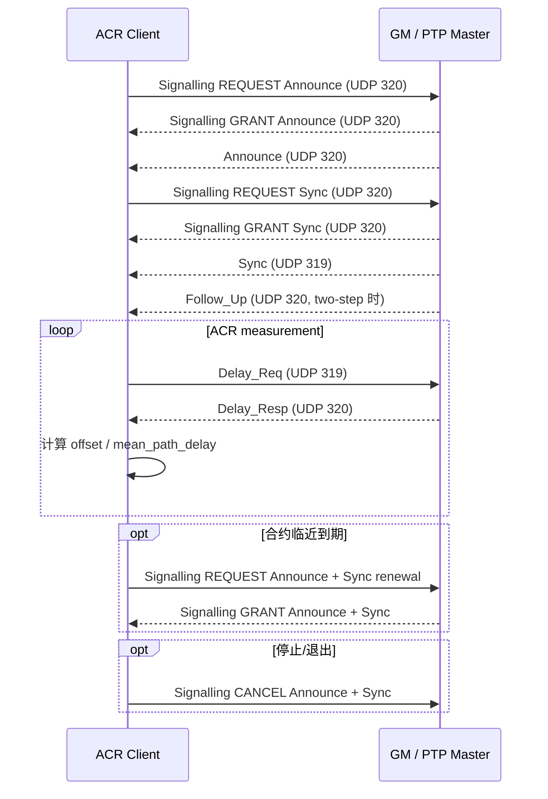
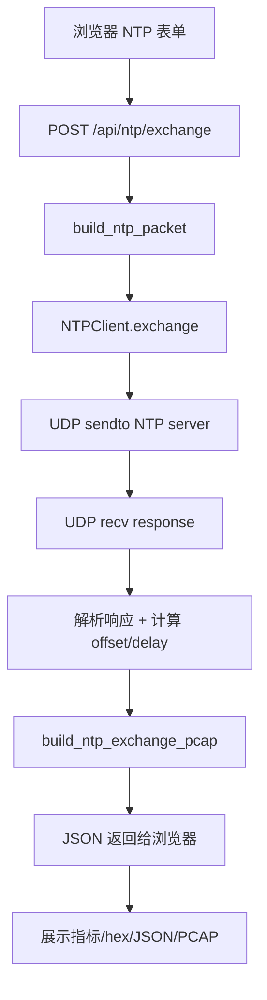
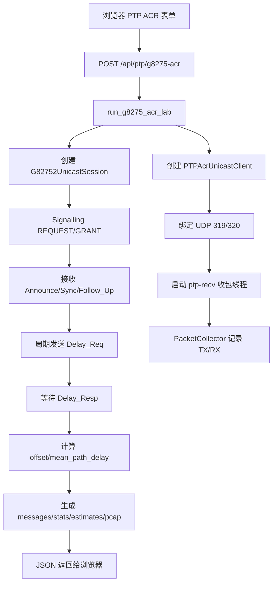

# 时间同步客户端工具分享文档

> 面向对象：组内首次接触本工具的同学。
> 覆盖范围：NTP 单次交换、PTP/G.8275.2 单播 ACR 联调、Web/CLI 使用方式、代码架构与数据流。
> 运行前提：Python 3.11+；Web 模式需要安装 `fastapi`/`uvicorn`；PTP 绑定 319/320 端口时可能需要管理员权限或 root/CAP_NET_BIND_SERVICE。

---

## 1. 工具定位

本仓库实现了一个用于时间同步协议学习、联调和抓包分析的实验工具，当前重点包括：

- **NTP 客户端实验**：构造 NTP 请求，发送到 NTP server，解析响应，计算 offset / round-trip delay，并导出 PCAP。
- **PTP/G.8275.2 单播 ACR 实验**：完成 G.8275.2 Signalling 协商，接收 Announce / Sync / Follow_Up，发送 Delay_Req，等待 Delay_Resp，输出 offset / mean path delay 估计和报文明细。
- **Web 实验台 + CLI**：Web 适合演示、抓包和字段调试；CLI 适合脚本化联调。

> 说明：当前 PTP 估计使用软件时间戳，即 `send()` / `recv()` 边界附近的系统时间。它适合协议流程、字段、互通和趋势观察，不等价于硬件时间戳下的最终同步精度。

---

## 2. NTP 与 ACR 的交互流程

### 2.1 NTP 单次请求/响应流程

NTP 使用 UDP/123。一次典型客户端交换包含 4 个关键时间戳：

| 记号 | 含义 | 产生位置 |
|------|------|----------|
| `t1` | 客户端发送请求时间，写入 request origin/transmit 相关字段 | Client |
| `t2` | 服务端收到请求时间 | Server |
| `t3` | 服务端发送响应时间 | Server |
| `t4` | 客户端收到响应时间 | Client |

本工具中 NTP 的主要步骤：

```text
用户输入 host/port/packet 字段
  ↓
构造 NTP request UDP payload
  ↓
UDP sendto(host, 123)
  ↓
等待 response
  ↓
解析 response 字段
  ↓
计算 offset 与 round-trip delay
  ↓
展示请求/响应 JSON、十六进制、PCAP 预览
```

计算公式采用常见 NTP 四时间戳模型：

```text
offset = ((t2 - t1) + (t3 - t4)) / 2
round_trip_delay = (t4 - t1) - (t3 - t2)
```

注意点：

- NTP 是一次请求、一次响应，不需要先协商合约。
- Web 页面允许覆盖 NTP 头字段，便于观察服务端如何响应异常或自定义字段。
- PCAP 导出是工具根据本地记录重新封装 IPv4/UDP 报文，用于 Wireshark 分析。

### 2.2 PTP/G.8275.2 ACR 交互流程

G.8275.2 是 PTP 电信单播场景。和 NTP 不同，PTP ACR 不是简单的一问一答，而是先通过 Signalling 协商单播报文，再基于 Sync/Follow_Up 与 Delay_Req/Delay_Resp 做 offset / delay 估计。

#### 2.2.1 端口与报文分类

| UDP 端口 | PTP 名称 | 典型报文 |
|----------|----------|----------|
| 319 | event port | Sync、Delay_Req |
| 320 | general port | Announce、Follow_Up、Delay_Resp、Signalling |

#### 2.2.2 建链与测量总流程



#### 2.2.3 ACR 一次测量的时间戳模型

一次 offset / delay 估计需要一组 Sync 样本和一次 Delay 交换：

| 记号 | 来源 | 含义 |
|------|------|------|
| `t1` | Sync 或 Follow_Up | GM 发送 Sync 的时间 |
| `t2` | 本地 recv 时间 | Client 收到 Sync 的时间 |
| `t3` | 本地 send 时间 | Client 发送 Delay_Req 的时间 |
| `t4` | Delay_Resp | GM 收到 Delay_Req 的时间 |

当前软件时间戳估计公式：

```text
offset = ((t2 - t1) - (t4 - t3)) / 2
mean_path_delay = ((t2 - t1) + (t4 - t3)) / 2
```

关键点：

- 两步法下，`Sync` 先到，`Follow_Up` 携带更精确的 `preciseOriginTimestamp`。
- `Delay_Req` 默认带 `flagField=0x400`，表示 unicast。
- `requestIntervalSec` 是客户端本地发送周期，不写入 PTP 报文字段。
- `correctionField`、链路不对称、软件时间戳抖动都会影响估计结果；当前工具主要用于流程互通和可观测性。

---

## 3. 工具使用

### 3.1 安装依赖

在仓库根目录执行：

```bash
python3 -m pip install -e '.[web]'
```

如果还要跑测试：

```bash
python3 -m pip install -e '.[web,dev]'
```

### 3.2 启动 Web 实验台

```bash
python3 -m ptp_client.web
```

默认监听：

```text
http://127.0.0.1:8765
```

Web 页面分两个 Tab：

- **NTP**：构造并发送 NTP 请求，展示响应、计算指标、导出 PCAP。
- **PTP ACR**：运行 G.8275.2 单播 ACR 流程，展示 Signalling/Sync/Delay 报文、统计和估计结果。

### 3.3 Web 使用：NTP

1. 打开 Web 页面，进入 **NTP** Tab。
2. 填写：
   - `主机`：例如 `pool.ntp.org` 或实验室 NTP server IP。
   - `端口`：默认 `123`。
   - `超时`：默认 `10s`。
3. 可选：修改 NTP 请求字段，例如 version、mode、stratum、timestamp。
4. 点击 **发送并接收**。
5. 查看：
   - offset / round-trip delay；
   - request / response 的结构化 JSON；
   - UDP payload hex；
   - PCAP 预览并下载。

### 3.4 Web 使用：PTP ACR

进入 **PTP ACR** Tab 后，重点字段如下：

| 字段 | 建议值 | 说明 |
|------|--------|------|
| `Master IP` | GM / ptp4l 所在 IP | 远端 GM 地址，不是本机地址 |
| `Domain` | `44` | G.8275.2 常用 domain |
| `Bind IP` | `0.0.0.0` 或本机网卡 IPv4 | 本地绑定地址；填错会导致 WinError 10049 / EADDRNOTAVAIL |
| `Bind port` | `319` 或 `0` | `319` 表示绑定 319/320；端口占用或权限不足时可试 `0` |
| `Clock identity` | 16 位 hex | 本客户端 PortIdentity.clockIdentity |
| `Port number` | `1` | 本客户端 PortIdentity.portNumber |
| `Announce log` | `0` | Announce 间隔 `2^n` 秒 |
| `Sync log` | `0` | Sync 间隔 `2^n` 秒 |
| `合约时长` | `60` 或更长 | Signalling durationField |
| `测量时长` | 演示可用 `30`/`90` | Web 为避免长期阻塞，建议设置有限时长 |
| `Flags` | `0x400` | Delay_Req unicast flag |
| `Request interval` | `1` | Delay_Req 本地发送周期，单位秒 |

运行步骤：

1. 确认 GM 已启动，并允许 G.8275.2 unicast grant。
2. 设置 `Master IP` 为 GM 地址。
3. `Bind IP` 推荐先用 `0.0.0.0`；如需指定网卡，用系统命令确认本机 IP：
   - Windows：`ipconfig`
   - Linux：`ip addr`
4. 点击 **运行 G8275 ACR**。
5. 查看结果：
   - `GM clock identity` / `gm_port_number`；
   - Signalling grants；
   - TX/RX 报文统计；
   - offset / mean_path_delay 序列；
   - 报文列表、单包 JSON、PCAP 下载。

常见错误：

| 现象 | 可能原因 | 处理 |
|------|----------|------|
| `WinError 10049` / 地址无效 | `Bind IP` 不是本机网卡地址 | 改为 `0.0.0.0` 或填 `ipconfig` 中的本机 IPv4 |
| 绑定 319/320 失败 | 端口被占用或权限不足 | 关闭占用程序、管理员/root 运行，或 `Bind port=0` |
| Signalling 超时 | GM 未开启 unicast grant、domain 不一致、防火墙拦截 | 检查 GM 配置、domain、UDP 319/320、防火墙 |
| 收到 Follow_Up 但缺 Sync | event port 319 未收到或被系统/防火墙影响 | 检查 319 入站、防火墙、网卡选择 |
| offset 抖动大 | 软件时间戳、系统调度、网络抖动 | 用于流程验证即可；精度验证需硬件时间戳/PHC |

### 3.5 CLI 使用

#### 3.5.1 构造 PTP 报文，不发包

```bash
python3 -m ptp_client.ptp build delay_req \
  --domain 44 \
  --flags 0x400 \
  --clock-identity 0001020304050607 \
  --port-number 1
```

#### 3.5.2 只做一次 Delay_Req / Delay_Resp

```bash
python3 -m ptp_client.ptp delay <GM_IP> \
  --domain 44 \
  --transport unicast \
  --bind 0.0.0.0 \
  --bind-port 319 \
  --timeout 8 \
  --delay-req-flags 0x400
```

#### 3.5.3 做一次 Sync + Delay 估计

```bash
python3 -m ptp_client.ptp estimate <GM_IP> \
  --domain 44 \
  --transport unicast \
  --bind 0.0.0.0 \
  --bind-port 319 \
  --sync-timeout 8 \
  --delay-timeout 8 \
  --delay-req-flags 0x400
```

#### 3.5.4 G.8275.2 协商 + ACR 测量

```bash
python3 -m ptp_client.ptp g8275-acr <GM_IP> \
  --domain 44 \
  --bind 0.0.0.0 \
  --bind-port 319 \
  --announce-log 0 \
  --sync-log 0 \
  --duration 60 \
  --measure-duration 90 \
  --sync-timeout 8 \
  --delay-timeout 8 \
  --delay-req-flags 0x400 \
  --delay-req-interval 1
```

#### 3.5.5 使用 JSON 配置和 PowerShell 脚本

仓库提供：

```text
config/ptp-acr-client.json
config/ptp-acr-client.schema.json
scripts/ptp-acr-config.ps1
```

配置文件适合 Windows/PowerShell 联调，字段会映射到 CLI 参数。核心字段：

- `master`：GM IP；
- `domain`：PTP domain；
- `mode`：`g8275-acr` / `g8275-negotiate` / `estimate` / `delay`；
- `bind`、`bindPort`：本地绑定地址和端口；
- `delayRequest.flags`：Delay_Req flags，G.8275.2 单播常用 `1024` (`0x400`)；
- `delayRequest.requestIntervalSec`：Delay_Req 发送周期。

---

## 4. 工具整体架构和数据流

### 4.1 代码模块概览

```text
src/ptp_client/
├── ntp/
│   ├── client.py            # NTP UDP 交换、offset/delay 计算
│   ├── request_builder.py   # NTP 请求构造
│   ├── serde.py             # NTP 字段解析/摘要
│   └── pcap.py              # NTP PCAP 封装
├── ptp/
│   ├── client.py            # PTP UDP 319/320 socket、收包线程、Delay/Sync 估计
│   ├── g82752_unicast.py    # G.8275.2 Signalling 协商、续约、CANCEL、ACR 循环
│   ├── signaling.py         # Signalling TLV 构造/解析
│   ├── request_builder.py   # PTP UDP payload 构造
│   ├── packet.py/header.py  # PTP header/body 解析
│   ├── delay_request.py     # Delay_Req 配置映射
│   ├── pcap.py              # PTP PCAP 封装
│   └── cli.py               # PTP CLI 入口
└── web/
    ├── app.py               # FastAPI 路由
    ├── ptp_lab.py           # Web PTP ACR runner、采集报文、返回结果
    └── static/              # HTML/JS/CSS Web 页面
```

### 4.2 Web NTP 数据流



主要文件：

- API：`src/ptp_client/web/app.py`
- NTP client：`src/ptp_client/ntp/client.py`
- 请求构造：`src/ptp_client/ntp/request_builder.py`
- 响应展示：`src/ptp_client/web/static/app.js`

### 4.3 Web PTP ACR 数据流



### 4.4 PTP 内部线程模型

当前单客户端实现里有两个核心对象：

| 对象 | 职责 |
|------|------|
| `PTPAcrUnicastClient` | 管 UDP socket、发包、收包线程、报文队列、Sync/Delay 等待与估计 |
| `G82752UnicastSession` | 管 G.8275.2 业务状态机：Signalling 协商、续约、测量循环、CANCEL |

线程与队列关系：

```text
主线程 / Web 请求线程
  ├── client.start()
  │     └── 启动 ptp-recv 线程
  ├── session.start_acr()
  │     └── 启动 g82752-manager 线程
  └── session.wait_acr()

ptp-recv 线程
  ├── select(event socket 319, general socket 320)
  ├── recvfrom()
  ├── 解析 PTP header
  └── 放入线程安全队列并 notify

g82752-manager 线程
  ├── 发 Signalling REQUEST
  ├── 从队列等待 GRANT / Announce / Sync / Follow_Up / Delay_Resp
  ├── 周期发 Delay_Req
  ├── 计算 offset / delay
  ├── 合约临期续约
  └── stop 时可发 CANCEL
```

### 4.5 PTP 报文采集与返回结构

Web 模式下，`PtpPacketCollector` 会记录每个 TX/RX 报文：

```text
PacketRecord
├── index
├── direction       # tx / rx
├── channel         # event / general / recv
├── wall_unix       # 本机记录时间
├── udp_hex         # UDP payload hex
└── summary         # 解析后的 PTP 摘要，Signalling 会展开 TLV
```

最终 `/api/ptp/g8275-acr` 返回的重点字段：

| 字段 | 含义 |
|------|------|
| `gm_clock_identity` | GM clockIdentity |
| `gm_port_number` | GM portNumber |
| `grants_sec` | Signalling GRANT duration |
| `stats` | 按 PTP message type 统计 TX/RX |
| `messages` | 每个报文的 hex 与结构化摘要 |
| `estimates` | 每次 offset / mean_path_delay 估计 |
| `last_estimate` | 最后一条估计结果 |
| `pcap_base64` | 可下载 PCAP |
| `pcap_preview_lines` | 页面展示的 PCAP hex 预览 |

---

## 5. 分享时建议演示顺序

1. **NTP 快速演示**：用 `pool.ntp.org` 发一次请求，看四时间戳、offset、PCAP。
2. **PTP 离线组包**：在 PTP ACR 页点击“预览报文”，展示 Delay_Req 的 header/body。
3. **G.8275.2 建链演示**：连接实验 GM，观察 Signalling REQUEST/GRANT、Announce、Sync、Follow_Up。
4. **ACR 测量演示**：观察 Delay_Req/Delay_Resp 周期、offset / mean_path_delay 曲线。
5. **故障演示**：把 Bind IP 改成不存在的地址，说明为什么会出现 WinError 10049，以及如何用 `0.0.0.0` 或本机网卡 IP 修复。
6. **代码走读**：按 `web/app.py` → `web/ptp_lab.py` → `ptp/client.py` → `ptp/g82752_unicast.py` 的顺序讲数据流。

---

## 6. 术语速查

| 术语 | 说明 |
|------|------|
| GM / Grandmaster | PTP 主时钟，给客户端提供时间源 |
| ACR | Adaptive Clock Recovery，自适应时钟恢复；本工具中侧重基于 PTP 报文估计 offset/delay |
| Sync | GM 周期发送的事件报文，携带或关联发送时间 |
| Follow_Up | 两步法中携带 Sync 精确发送时间的 general 报文 |
| Delay_Req | Client 发给 GM 的事件报文，用于测路径延迟 |
| Delay_Resp | GM 返回的 general 报文，携带 GM 收到 Delay_Req 的时间 |
| Signalling | PTP 管理/协商类报文，G.8275.2 中用于 REQUEST/GRANT/CANCEL 单播合约 |
| domainNumber | PTP 域号；客户端和 GM 必须一致 |
| correctionField | PTP 中用于累计链路/透明时钟修正的字段 |
| one-step / two-step | 一步法 Sync 直接带时间戳；两步法用 Sync + Follow_Up |
